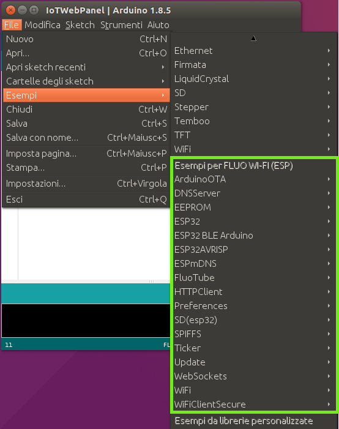
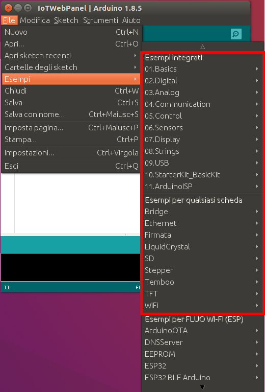

# FluoGuide

There are 3 programming modes available for your Fluo Boards.

## Contents

1. [IoT Panel mode](#iot-panel-mode)

2. [Arduino like mode (AVR side)](#arduino-like-mode-avr-side)

3. [ESP32 Programming mode (ESP side)](#esp32-programming-mode-esp-side)

## IoT Panel mode

Your Fluo board will have this Software on board by default.
In this mode it is not necessary to write code, use this mode if you want to realize your IoT ReadyToGo system without writing a line of code

The basic IoT module is already available, while additional modules are available through your board's SD memory.

Instructions for setting up your IoT Panel for the first time: [First configuration](http://fluotechnology.co.uk/home/wiki/#iot)

**Le istruzioni per aggiornare o ripristinare il vostro IoT Panel tramite Arduino IDE FluoEdition: link (da guardare)**

## Arduino like mode (AVR side)

In this mode you have all the power of the Arduino ecosystem, in fact all the libraries and sketches available for the generic Arduino boards are also available for the Fluo.
Through the API exposed by the FluoTube library it will also be possible to access all the other IoT features of the card such as: WiFi - BLE - SD card

To use this mode you must use ArduinoIDE Fluo Edition and follow the following steps:

  1. Open ArduinoIDE FluoEdition
  2. Select the board -> Tools/Board/FLUO WI-FI(ESP)
  3. Select the serial port -> Tools/Port/Select the FLUO WI-FI port
  4. Open the example -> File/Examples/Examples for FLUO WI-FI/FluoTube/IoTWebPanel
  5. Upload the file
 Now it's possible to select the board -> Tools/Board/FLUO WI-FI(AVR)
 Normally use ArduinoIDE with all its libraries and examples
 
 **Per comprendere come utilizzare la parte IoT della scheda, alcuni esempi sono disponibili qui:
Example->FluoTube**

**Il link alla guida completa di FluoTube: link**
 
## ESP32 Programming mode (ESP side)

In this mode programs the ESP32 directly and use the AVR part as Slave to manage the GPIOs present on the header of your Fluo board.

To use this mode you have to follow the following steps:
  1. Open ArduinoIDE FluoEdition
  2. Select the board -> Tools/Board/FLUO WI-FI(ESP)
  3. Select the serial port -> Tools/Port/Select the FLUO WI-FI port
  4. Open the example -> File/Esamples/Examples for FLUO WI-FI/...
  5. Upload the file

List examples and libraries available for ESP side (ESP32):
  * ArduinoOTA/BasicOTA
  * DNSServer/CaptivePortal
  * EEPROM/eeprom_write
  * ESP32
    - ChipID
    - DeepSleep
    - ESPNow
    - HallSensor
    - ResetReason
    - Time
    - Timer
    - Touch
  * ESP32BLEArduino/
    - BLE_client
    - BLE_notify
    - BLE_scan
    - BLE_server
    - BLE_uart
    - BLE_write
  * ESP32AVRISP/OTAsideAVR
  * ESPmDNS/
    - mDNS-SD-Extended
    - mDNS_Web_Server
  * FluoTube/IoTWebPanel
  * HTTPClient/
    - Authorization
    - BasicHttpClient
    - ReuseConnection
    - StreamHttpClient
  * Preferences/StartCounter
  * SD(esp32)/SD_Test
  * SPIFFS/SPIFFS_Test
  * Ticker/
    - Arguments
    - Blinker
  * Update/
    - AWS_S3_OTA_Update
    - SD_Update
  * WebSockets
    - avr/WebSocketClientAVR
    - esp32/
      - WebSocketClient
      - WebSocketClientSSL
      - WebSocketServer
  * WiFi/
    - SimpleWiFiServer
    - WPS
    - WiFiBlueToothSwitch
    - WiFiClient
    - WiFiClientBasic
    - WiFiClientEvents
    - WiFiClientStaticIP
    - WiFiIPv6
    - WiFiMulti
    - WiFiScan
    - WiFiSmartConfig
    - WiFiUDPClient
  * WiFiClientSecure/WiFiClientSecure
  

Instead it is not possible to use the classic examples and the generic Arduino libraries on Esp32.

**Guida per gestire gli headers della vostra Fluo board tramite l ESP32 : link -> Virtualxxx**
